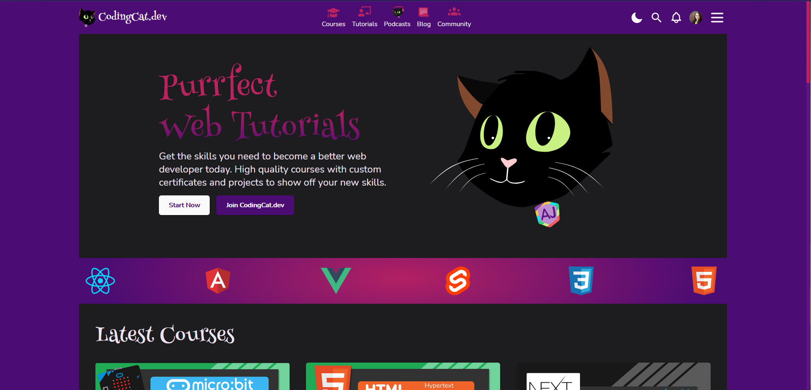

# Brittney Postma

## **Frontend Designer & Developer**

## Links

🌐 Landing page - [brittneypostma.com](https://brittneypostma.com)

🌊 Portfolio - [bdesigned.dev](https://bdesigned.dev)

🖋 Blog - [theconsolelogs.com](https://theconsolelogs.com)

📝 DEV.to - [@bdesigned](https://dev.to/bdesigned)

## ☎️ Contact information

📧 [bdesignedwebdev@gmail.com](mailto:bdesignedwebdev@gmail.com)

🔗 [LinkedIn profile](https://www.linkedin.com/in/brittney-postma-868928178/)

🐤 [Twitter - @brittneypostma](https://twitter.com/brittneypostma)

🌿 [Github](https://github.com/brittneypostma)

## ⬇ Jump To

📃 [Summary]()

**👩🏻‍💻** [Work Experience]()

💻 [Technology]()

🖼 [Projects]()

📚 [Education]()

---

## 📃 Summary

> I love developing web sites that are beautiful, but also fluid, responsive, and easy to use. I focus on UX/UI design with an extensive knowledge of HTML/CSS/JS, React, Svelte, SEO, and logo design. I have a background in Graphic Design and building out design systems with the Atomic Design methodology. I thrive in the front of the frontend and stitching together the Jamstack. I have recently been working with Next.JS and SvelteKit.

---

## **👩🏻‍💻** Work experience

### Online Instructor

*Auth0*

Learner's Path YouTube series for Auth0 teaching **Svelte** and **Svelte-Kit** file-based routing, API routes, dynamic routes, global and scoped CSS.

*ZTM Academy*

Lead a ZTM Academy exclusive **Responsive Web Design** workshop focused on teaching you how to deliver a fluid, consistent design using modern CSS tools and responsive web design best practices. 

### Freelance

*CodingCat.dev*

Built a **design system** and **style guide** from scratch and implemented into a **Next.JS** frontend with **TailwindCSS**.

🌐 [codingcat.dev](https://codingcat.dev)

*Learn Build Teach*

Created a new **logo design**, community meetup **templates**, and **emojis** for the **Learn Build Teach** discord community by **James Q. Quick**.

🌐 [learnbuildteach.com](https://learnbuildteach.com)

---

## 💻 Technology

- SvelteKit
- NextJS
- TailwindCSS
- API's
- Markdown
- HTML/CSS/JS

---

## 🖼 Projects

- **[Coding Cat Dev](https://codingcat.dev) -** *NextJS, TailwindCSS, Firebase*

    Built a **design system** and **style guide** from scratch and implemented into a **Next.JS** frontend with **TailwindCSS**.

    ### 🥇Accomplishments

         ✏ Created a design system and style guide in Figma.

         ✏ Used TailwindCSS to use design system in frontend.

         ✏ Used React with NextJS to integrate API's like Cloudinary and Firebase.

    - **Screenshot**

        

    - **Embed**

        [https://codingcat.dev](https://codingcat.dev)

- Brent DeYoung Builders - *NextJS, TailwindCSS, Sanity*

    Created a new design from scratch and implemented the frontend into a Next.JS, TailwindCSS, and Sanity stack.

    ### 🥇Accomplishments

         ✏ Created a design in Figma.

         ✏ Used TailwindCSS to use design system in frontend.

         ✏ Used React with NextJS to integrate with SanityCMS.

    - **Screenshot**

        

    - **Embed**

        [https://main.brentdeyoungbuilders.com/](https://main.brentdeyoungbuilders.com/)

- **[The Console Logs](https://theconsolelogs.com) -** *Svelte, Sapper, Markdown*

    In this project, I built a blog site using Svelte and Sapper to keep all of my notes as I was learning development. I am in the process of converting this site to SvelteKit.

    ### 🥇Accomplishments

         ✏ Added PrismaJS to colorize code blocks.

         ✏ Used remark to pull in Markdown pages and parse them to Sapper.

         ✏ Notes on over 10 different tech languages in Markdown.

    - **Screenshot**

        

    - **Embed**

        [https://theconsolelogs.com](https://theconsolelogs.com)

- Volunteer Check In System for Elementary School - *Svelte, Sapper, Google Sheets*

    In this project, I used Svelte and Sapper to build a check-in system for volunteers at my children's elementary school. This app allows volunteers to check in and out when they are at the school and posts the data to a Google Sheet spreadsheet for tracking.

    ### 🥇Accomplishments

         ✏ Built a search box pulling in data from a json file.

         ✏ Connected to Google Sheets for easy tracking of volunteer hours.

         ✏ Dealt with time tracking and dates with Svelte and JavaScript.

    Due to the sensitive nature of the information, I cannot display this site.

---

## 📚 Education

### Harvard University

***CS50** - March 2020*

- [Certificate](https://certificates.cs50.io/1ebc5e06-e622-4318-8546-2610091ba583.pdf?size=letter)

    

### University of Michigan

***Responsive Web Design** - January 2019*

- [Certificate](https://www.coursera.org/account/accomplishments/verify/VQ4CFQXT9962)

    [Completion Certificate for Advanced Styling with Responsive Design](https://www.coursera.org/account/accomplishments/verify/VQ4CFQXT9962)

### Udemy

***Advanced JavaScript Concepts** - February 2020*

- Certificate

    [Udemy Course Completion Certificate](https://www.udemy.com/certificate/UC-297ef291-075b-42cc-9ae4-62267acbd58c/)

***Complete React Developer** - July 2019*

- Certificate

    [Udemy Course Completion Certificate](https://www.udemy.com/certificate/UC-CYI6Z72I/)

***Complete Web Development Bootcamp** - June 2019*

- Certificate

    [Udemy Course Completion Certificate](https://www.udemy.com/certificate/UC-OBAORP3A/)
